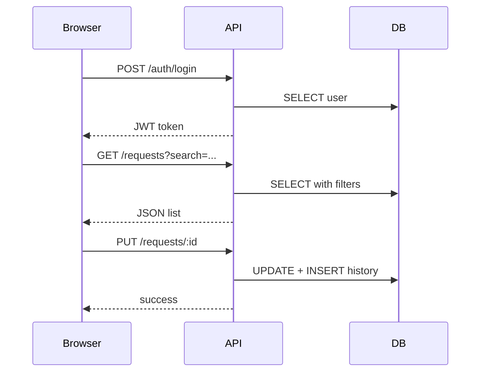

# REST API — IT Requests System

Базовый URL: `/api`. Авторизация: заголовок `Authorization: Bearer <token>`.

## Схема взаимодействия

## Endpoints

| Метод | Путь | Описание | Роли |
|-------|------|----------|------|
| GET | `/health` | Проверка работоспособности | — |
| POST | `/auth/login` | Вход | — |
| POST | `/auth/register` | Регистрация | — |
| GET | `/categories` | Список категорий | auth |
| GET | `/requests` | Список заявок (фильтры: status, priority, category_id, search) | auth |
| GET | `/requests/:id` | Одна заявка | auth |
| POST | `/requests` | Создать заявку | auth |
| PUT | `/requests/:id` | Обновить заявку | auth / IT для статуса |
| DELETE | `/requests/:id` | Удалить заявку | creator (new) / IT |
| GET | `/requests/:id/comments` | Комментарии | auth |
| POST | `/requests/:id/comments` | Добавить комментарий | auth |
| GET | `/requests/:id/history` | История статусов | auth |
| GET | `/statistics` | Статистика | auth |
| GET | `/users/it-specialists` | Список исполнителей | auth |
