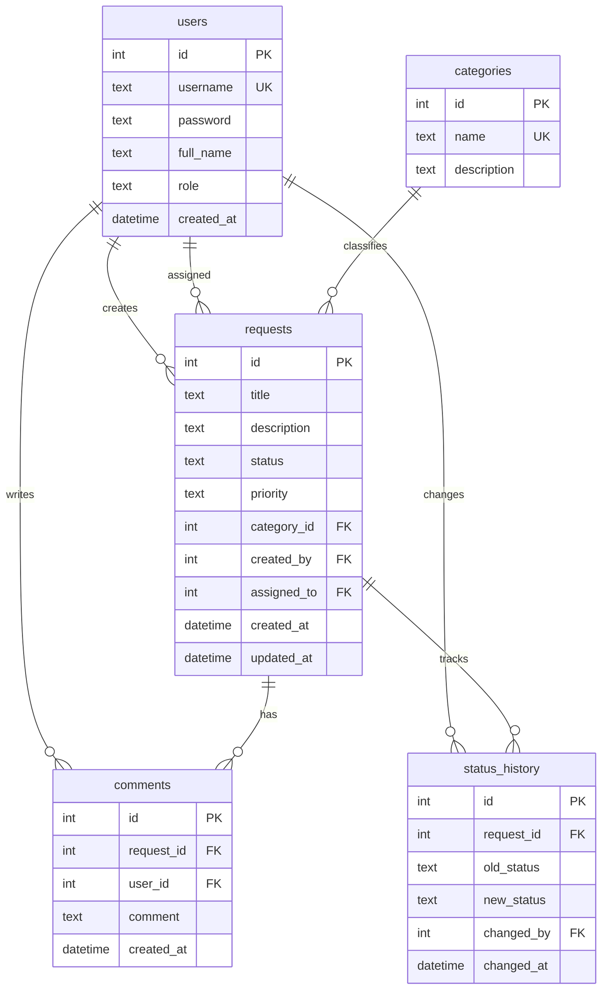

# База данных — IT Requests System

СУБД: **SQLite**. Скрипт создания: `backend/database/init.sql`.

## ER-диаграмма



## Описание таблиц

| Таблица | Назначение |
|---------|------------|
| `users` | Пользователи системы (сотрудник / IT-специалист) |
| `categories` | Категории заявок (оборудование, ПО, сеть и т.д.) |
| `requests` | Заявки в IT-отдел |
| `comments` | Комментарии к заявкам |
| `status_history` | История изменения статусов |

## Примеры SQL-запросов

```sql
-- Все открытые заявки с категорией и автором
SELECT r.id, r.title, r.status, c.name AS category, u.full_name AS author
FROM requests r
LEFT JOIN categories c ON r.category_id = c.id
JOIN users u ON r.created_by = u.id
WHERE r.status IN ('new', 'in_progress')
ORDER BY r.created_at DESC;

-- Количество заявок по категориям
SELECT c.name, COUNT(r.id) AS total
FROM categories c
LEFT JOIN requests r ON c.id = r.category_id
GROUP BY c.id;

-- История статусов заявки №2
SELECT sh.old_status, sh.new_status, u.full_name, sh.changed_at
FROM status_history sh
JOIN users u ON sh.changed_by = u.id
WHERE sh.request_id = 2
ORDER BY sh.changed_at;
```

## Демо-данные

После инициализации доступны пользователи `ivanov`, `petrov`, `sidorova` (пароль `password123`) и три примера заявок.
